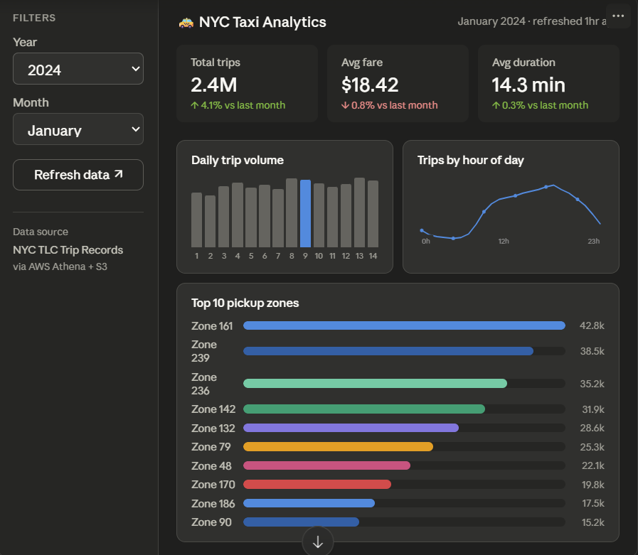

# AWS Serverless Analytics Dashboard

A serverless data pipeline and analytics dashboard built with Python and AWS. Ingests NYC Taxi trip data, transforms it into Parquet format, stores it in S3, queries it via Athena, and visualizes it in a Streamlit dashboard.

## Preview



## Architecture

```
Public Dataset (NYC Taxi)
        │
        ▼
  [Lambda / local]
  ingestion/fetch_data.py
        │
        ▼
  S3 Raw Bucket
  s3://your-bucket/raw/
        │
        ▼
  transform/process.py
  (Pandas → Parquet, partitioned by year/month)
        │
        ▼
  S3 Processed Bucket
  s3://your-bucket/processed/
        │
        ▼
  AWS Athena (SQL queries)
        │
        ▼
  Streamlit Dashboard
  dashboard/app.py
```

## Stack

| Layer | Tool |
|---|---|
| Language | Python 3.11 |
| Infrastructure | Terraform |
| Storage | S3 (Parquet, partitioned) |
| Query | AWS Athena + Glue Catalog |
| Orchestration | AWS Lambda |
| Dashboard | Streamlit |
| CI/CD | GitHub Actions |

## Prerequisites

- Python 3.11+
- AWS CLI configured (`aws configure`)
- Terraform >= 1.5
- An AWS account with appropriate IAM permissions

## Getting Started

### 1. Clone and install dependencies

```bash
git clone https://github.com/your-username/aws-analytics-dashboard.git
cd aws-analytics-dashboard
python -m venv .venv
source .venv/bin/activate  # Windows: .venv\Scripts\activate
pip install -r requirements.txt
```

### 2. Configure environment

```bash
cp .env.example .env
# Edit .env with your AWS bucket name, region, etc.
```

### 3. Deploy infrastructure

```bash
cd infrastructure/terraform
terraform init
terraform plan
terraform apply
```

### 4. Run the pipeline

```bash
# Fetch and upload raw data
make ingest

# Transform raw → Parquet and re-upload
make transform

# Launch dashboard locally
make dashboard
```

## Project Structure

```
aws-analytics-dashboard/
├── ingestion/
│   └── fetch_data.py        # Downloads dataset, uploads raw CSV to S3
├── transform/
│   └── process.py           # Cleans data, outputs partitioned Parquet to S3
├── dashboard/
│   ├── app.py               # Streamlit app
│   └── queries.py           # Athena query helpers
├── infrastructure/
│   ├── terraform/
│   │   ├── main.tf          # S3, Athena, Lambda, Glue resources
│   │   ├── variables.tf
│   │   └── outputs.tf
│   └── athena_queries/
│       ├── trips_by_day.sql
│       └── top_zones.sql
├── .github/
│   └── workflows/
│       └── deploy.yml       # CI: lint, test, terraform plan
├── .env.example
├── Makefile
└── requirements.txt
```

## Makefile Commands

```bash
make ingest       # Run ingestion pipeline
make transform    # Run transformation pipeline
make dashboard    # Launch Streamlit locally
make tf-plan      # Terraform plan
make tf-apply     # Terraform apply
make lint         # Run ruff linter
make test         # Run pytest
```

## Data

This project uses the [NYC TLC Trip Record Data](https://www.nyc.gov/site/tlc/about/tlc-trip-record-data.page) — a free, public dataset with millions of taxi trip records. No sign-up required.

## Cost Estimate

Running this project in AWS is very low cost:
- **S3**: ~$0.023/GB/month for storage
- **Athena**: ~$5/TB scanned (Parquet compression reduces this significantly)
- **Lambda**: Free tier covers typical usage
- Always run `terraform destroy` when not in use to avoid charges.

## License

MIT
